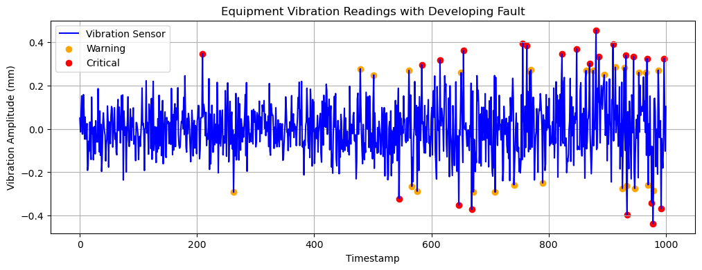
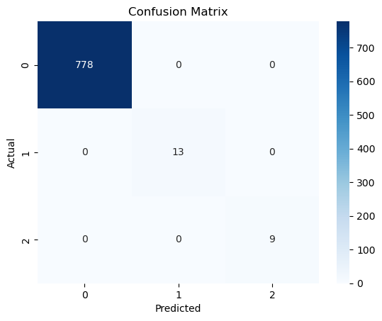
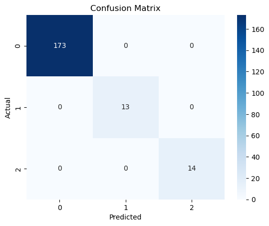
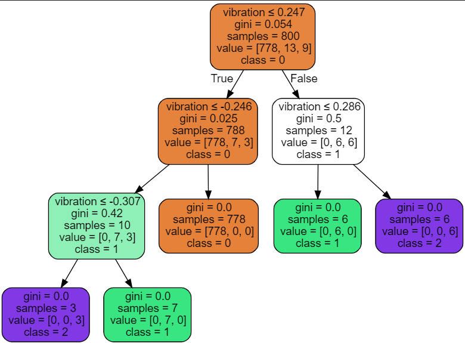
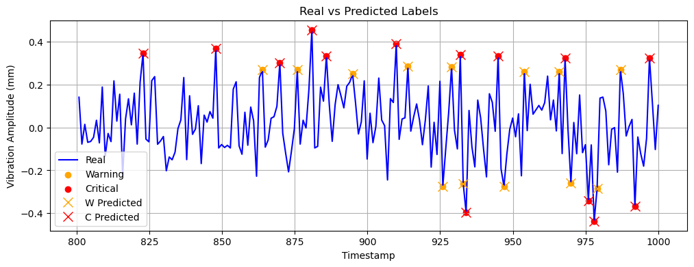
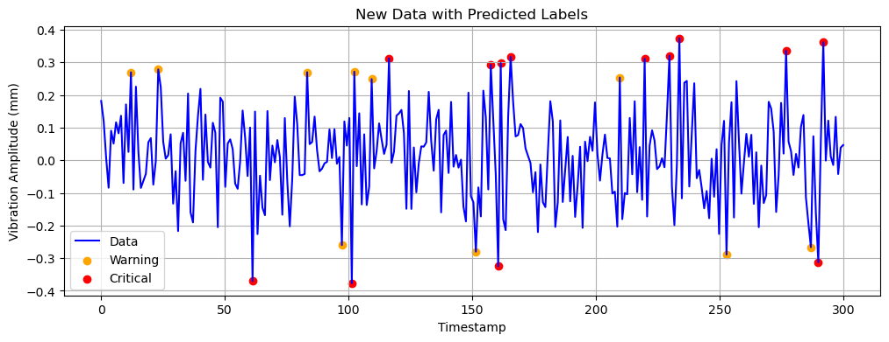

# Example on fault detection

This Notebook is a simple example to develop a model to detect fault signals on an equipment with vibration sensor.



## Creating the signal
First, we create a signal, considering a small amplitude variation.

```python

np.random.seed(42)
time_points = 1000
normal_operation =  0.1 * np.random.randn(500)

``` 

Then, the mean and standard deviation are calculated:

```python

mean = normal_operation.mean()
std = normal_operation.std()

``` 

With these values in hand, we can label faults based on mean + std.

Next, we create a series of signals to simulate faults by introducing small increments in signal amplitude:

```python

developing_fault =  0.13 * np.random.randn(150)
developing_fault2 = 0.14 * np.random.randn(100)
developing_fault3 = 0.15 * np.random.randn(130)
developing_fault4 = 0.18 * np.random.randn(120)

``` 

Then all signals are concatenated

```python

sensor_data = np.concatenate([normal_operation, developing_fault,developing_fault2, developing_fault3, developing_fault4])

```

## Labeling faults

To label the faults, we classify the signals as normal, warning, and critical.

As mentioned, we set up a rule using mean + std:

```python

labels = np.zeros_like(sensor_data)

for i in range(len(sensor_data)): 
    if abs(sensor_data[i]) > mean + 3 * std:
        labels[i] = 2
    elif abs(sensor_data[i]) > mean + 2.5 * std:
        labels[i] = 1

``` 

Then, we finalize by creating a DataFrame:

```python

maintenance_df = pd.DataFrame({
    'timestamp': np.linspace(0, 1000, len(sensor_data)),
    'vibration': sensor_data,
    'label': labels
})
maintenance_df.set_index('timestamp', inplace=True)

```

This is our synthetic vibration monitoring signal:


## Creating a ML model (Decision Tree)

To create a machine learning model with the task to classify the faults, we will use ***Decision Tree classifier.***

> A Decision Tree Classifier is a simple AI model that makes decisions like a flowchart. It asks a series of yes/no questions to sort data into categories. Imagine deciding whether to bring an umbrella: You check if it's cloudy, then if rain is forecasted. Similarly, a decision tree splits data based on features until it reaches a final decision. It's widely used in tasks like diagnosing diseases, filtering spam emails, or recommending products. Decision trees are easy to understand, but they can become complex with too many branches.

First, we divide the features and labels and split the dataset into training and test sets.

We split it as a time series, considering the first 80% as the training set and the last 20% as the test set.

```python

X = maintenance_df[['vibration']]
y = maintenance_df['label']

X_train = X[:int(0.8*len(X))]
X_test = X[int(0.8*len(X)):]

y_train = y[:int(0.8*len(y))]
y_test = y[int(0.8*len(y)):]

```

Then, we train a Decision Tree model:

(No hyperparameter tuning is performed here.)

```python

model = DecisionTreeClassifier( random_state=42)
model.fit(X_train, y_train)

```

After that, we evaluate our model on both training and test data:

```python

pred_train = model.predict(X_train)
accuracy = accuracy_score(y_train, pred_train)
print("\nTrain Accuracy:", accuracy)

pred_test = model.predict(X_test)
accuracy = accuracy_score(y_test, pred_test)
print("\nTest Accuracy:", accuracy)

```

```python
output:
Train Accuracy: 1.0

Test Accuracy: 1.0

```

Additionaly, we can evaluate the confusion matrix on a heatmap:

```python

print("\nTraining Confusion Matrix:")
sns.heatmap(confusion_matrix(y_train, pred_train), annot=True, fmt='d', cmap='Blues')
plt.xlabel('Predicted')
plt.ylabel('Actual')
plt.title('Confusion Matrix')
plt.show()

print("\nTest Confusion Matrix:")
sns.heatmap(confusion_matrix(y_test, pred_test), annot=True, fmt='d', cmap='Blues')
plt.xlabel('Predicted')
plt.ylabel('Actual')
plt.title('Confusion Matrix')
plt.show()

```
Training Confusion Matrix:


Test Confusion Matrix:



We can also see how the decison tree makes its decision



## Evaluating

To visually check the predictions vs. true labels, we plot a chart showing the signal with actual and predicted labels:



## Predicting with new data

Since incoming data will not have labels, the model is used to predict the label as each signal enters the pipeline.

Here, we simulate new data entry, which the model has not seen before, and follow the same steps as before:

```python

#New signal
new_period = np.linspace(0, 300, 300)

new_data1 = 0.13 * np.random.randn(200)
new_data2 = 0.145 * np.random.randn(100)
new_data = np.concatenate([new_data1, new_data2])

#Predict the faults
new_pred = model.predict(new_data.reshape(-1, 1)) 


new_data = pd.DataFrame({
    'timestamp': new_period,
    'vibration': new_data,
    'label': new_pred
})
new_data.set_index('timestamp', inplace=True)

```

So we have the following result

